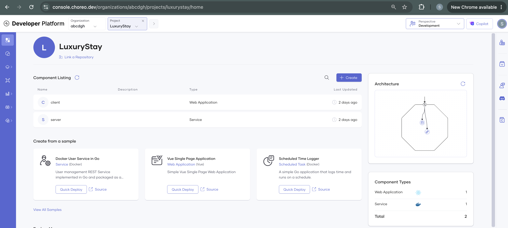
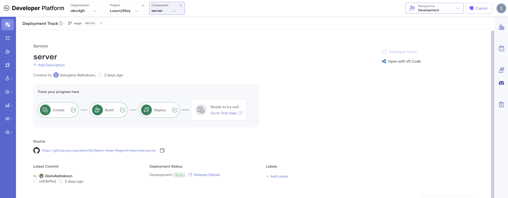
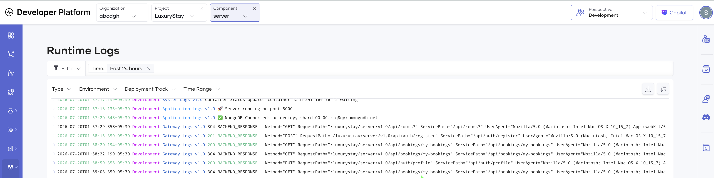
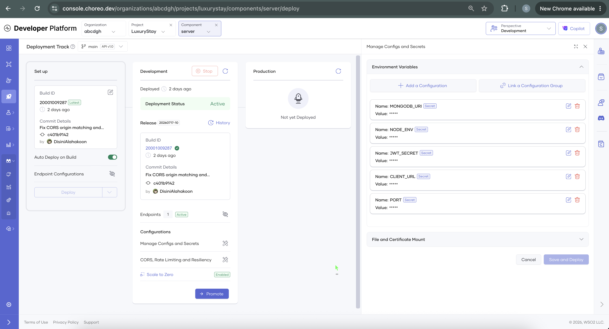
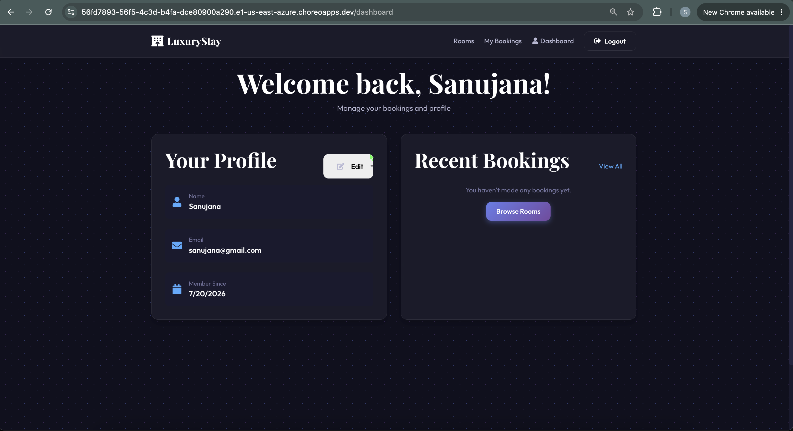
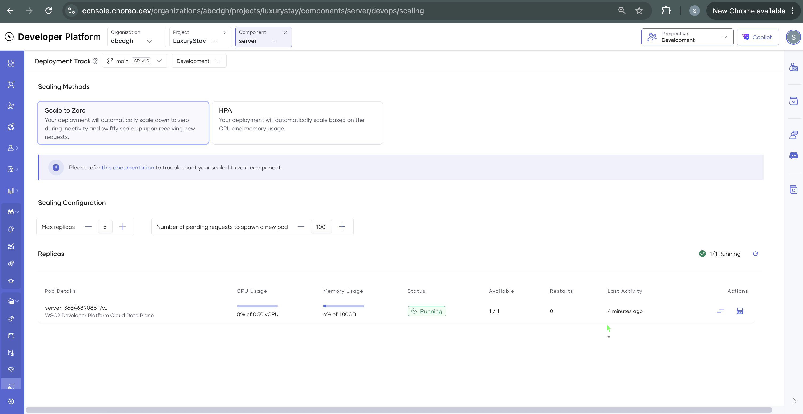

# Hotel Management System - MERN Stack

A full-stack hotel management application built with MongoDB, Express.js, React, and Node.js. Features role-based access control, modern UI with smooth animations, and comprehensive booking functionality.

## 🌟 Features

### User Features
- ✅ User authentication (Login/Register)
- ✅ Browse available rooms with filters
- ✅ View room details
- ✅ Book rooms (with date selection)
- ✅ View personal bookings
- ✅ Leave reviews

### Admin Features
- ✅ Admin dashboard with analytics
- ✅ Manage rooms (Create, Read, Update, Delete)
- ✅ View all bookings
- ✅ Manage users
- ✅ Update booking status

### UI/UX
- ✨ Modern glassmorphism design
- ✨ Smooth Framer Motion animations
- ✨ Responsive design for all devices
- ✨ Toast notifications
- ✨ Loading states

## 🛠️ Tech Stack

### Backend
- **Node.js** - Runtime environment
- **Express.js** - Web framework
- **MongoDB** - Database
- **Mongoose** - ODM
- **JWT** - Authentication
- **bcryptjs** - Password hashing

### Frontend
- **React** - UI library
- **Vite** - Build tool
- **React Router** - Routing
- **Framer Motion** - Animations
- **Axios** - HTTP client
- **React Icons** - Icon library

## 📋 Prerequisites

Before you begin, ensure you have the following installed:
- Node.js (v16 or higher)
- MongoDB (local or Atlas account)
- npm or yarn

## 🚀 Installation & Setup

### 1. Clone the repository
```bash
git clone <repository-url>
cd hotel2
```

### 2. Backend Setup

```bash
# Navigate to server directory
cd server

# Install dependencies
npm install

# Create .env file (if not exists) and configure:
PORT=5000
MONGODB_URI=mongodb://localhost:27017/hotel-management
JWT_SECRET=your_super_secret_jwt_key_change_this_in_production
NODE_ENV=development
CLIENT_URL=http://localhost:5173

# Start MongoDB (if running locally)
# On macOS with Homebrew:
brew services start mongodb-community

# Start the server
npm run dev
```

The backend server will run on **http://localhost:5000**

### 3. Frontend Setup

Open a new terminal:

```bash
# Navigate to client directory
cd client

# Install dependencies
npm install

# Start the development server
npm run dev
```

The frontend will run on **http://localhost:5173**

### 4. Running with Docker 🐳

The easiest way to run the application is using Docker Compose. This works for both development and production-like environments.

**Prerequisites:**
- Docker Desktop installed and running

**Steps:**

```bash
# Build and start all containers (MongoDB, Server, Client)
docker-compose up --build

# Run in detached mode (background)
docker-compose up -d --build

# Stop all containers
docker-compose down
```

- **Client**: http://localhost:5173
- **Server**: http://localhost:5000
- **MongoDB**: localhost:27017

> **Note:** If you make changes to package.json or want fresh builds, always use the `--build` flag.


## ☁️ Live Deployment (WSO2 Choreo)

This application is deployed on **WSO2 Choreo** as two components — a React **Web Application** (frontend) and a Dockerized Node/Express **Service** (backend) — with the database on **MongoDB Atlas**.

```
Browser ──► Choreo Web App (React)  ──►  Choreo Gateway  ──►  Choreo Service (Node/Express)  ──►  MongoDB Atlas
```

**Live URLs** _(hosted on Choreo's 2-week free trial — may be inactive by the time you read this; the screenshots below are the durable record)_:

- **Frontend:** _add your Choreo Web App URL_
- **Backend API:** `https://…choreoapis.dev/luxurystay/server/v1.0`

> ℹ️ The entire deployment is **reproducible from this repo** — `server/Dockerfile`, `server/.choreo/component.yaml`, and the runtime config are all committed. Only secrets (`MONGODB_URI`, `JWT_SECRET`) are supplied through Choreo's Configs & Secrets, never checked in.

### Deployment evidence

Since the live trial may expire, these screenshots are the durable record that the deployment worked end to end:

| | |
|---|---|
| Choreo project — both components deployed |  |
| Backend deploy succeeded |  |
| Backend running (`MongoDB Connected`) |  |
| Configs & Secrets (values masked) |  |
| Live app with real data |  |
| Registration/login working end to end |  |
| Scale-to-zero enabled |  |


## 📱 Usage

### Default Credentials

You can register new users with either role:
- **Customer** - Can view and book rooms
- **Admin** - Full access to manage rooms, bookings, and users

### Testing the Application

1. **Start both servers** (backend and frontend)
2. **Open browser** and navigate to http://localhost:5173
3. **Register** a new account (try both customer and admin roles)
4. **Explore features**:
   - Browse rooms
   - View room details
   - Admin: Create new rooms
   - Admin: View dashboard analytics

## 🏗️ Project Structure

```
hotel2/
├── server/                 # Backend
│   ├── config/            # Database configuration
│   ├── models/            # Mongoose models
│   ├── controllers/       # Route controllers
│   ├── routes/            # API routes
│   ├── middleware/        # Custom middleware
│   └── server.js          # Entry point
│
├── client/                # Frontend
│   ├── src/
│   │   ├── components/    # Reusable components
│   │   │   ├── ui/       # UI components
│   │   │   └── layout/   # Layout components
│   │   ├── pages/        # Page components
│   │   │   └── admin/    # Admin pages
│   │   ├── context/      # React context
│   │   ├── utils/        # Utility functions
│   │   ├── App.jsx       # Main app component
│   │   └── main.jsx      # Entry point
│   └── index.html
│
└── README.md
```

## 🔑 API Endpoints

### Authentication
- `POST /api/auth/register` - Register new user
- `POST /api/auth/login` - Login user
- `POST /api/auth/logout` - Logout user
- `GET /api/auth/me` - Get current user
- `PUT /api/auth/profile` - Update profile

### Rooms
- `GET /api/rooms` - Get all rooms (with filters)
- `GET /api/rooms/:id` - Get single room
- `POST /api/rooms` - Create room (Admin only)
- `PUT /api/rooms/:id` - Update room (Admin only)
- `DELETE /api/rooms/:id` - Delete room (Admin only)

### Bookings
- `POST /api/bookings` - Create booking
- `GET /api/bookings/my-bookings` - Get user bookings
- `GET /api/bookings` - Get all bookings (Admin only)
- `PUT /api/bookings/:id/status` - Update booking status (Admin only)
- `PUT /api/bookings/:id/cancel` - Cancel booking

### Admin
- `GET /api/admin/dashboard` - Get dashboard stats
- `GET /api/admin/users` - Get all users
- `DELETE /api/admin/users/:id` - Delete user
- `PUT /api/admin/users/:id/role` - Update user role

## 🎨 Design Features

- **Glassmorphism** - Modern frosted glass effect
- **Gradient Text** - Eye-catching gradient headlines
- **Smooth Animations** - Framer Motion powered transitions
- **Responsive Design** - Works on all screen sizes
- **Dark Theme** - Modern dark color scheme

## 🔒 Security Features

- JWT authentication with HTTP-only cookies
- Password hashing with bcrypt
- Role-based access control
- Input validation
- CORS configuration

## 🚧 Future Enhancements

- Payment gateway integration (Stripe/PayPal)
- Email notifications
- Advanced booking calendar
- Reviews and ratings system
- Image upload functionality
- Real-time availability updates
- Multi-language support

## 📝 License

This project is open source and available under the MIT License.


---

## 🐛 Common Issues & Solutions

### MongoDB Connection Error
```bash
# Make sure MongoDB is running
brew services start mongodb-community  # macOS
sudo systemctl start mongod            # Linux
```

### Port Already in Use
```bash
# Kill process on port 5000
lsof -ti:5000 | xargs kill -9

# Kill process on port 5173
lsof -ti:5173 | xargs kill -9
```

### Dependencies Issues
```bash
# Clear npm cache and reinstall
rm -rf node_modules package-lock.json
npm install
```
